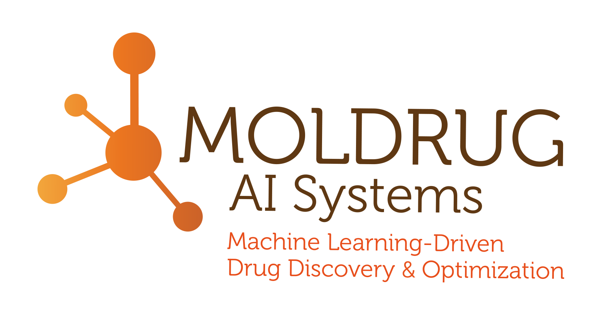

&nbsp;&nbsp;&nbsp;&nbsp;&nbsp;&nbsp;

## Computational science for safer chemicals and better therapeutics

**Chemoinformatics · Artificial Intelligence · Molecular Modelling · Omics · Computational Toxicology**

 

 

---

## About us

**ProtoQSAR** and **MolDrug AI Systems** develop and apply advanced computational approaches to address challenges across **chemical safety, toxicology and drug discovery**.

Our multidisciplinary teams combine **chemoinformatics, machine learning, molecular modelling, structural bioinformatics and omics** to transform chemical and biological data into actionable scientific knowledge.

 

### ProtoQSAR

**Computational solutions for chemical safety and molecular property prediction.**

ProtoQSAR specializes in the development and application of **QSAR models, chemoinformatics and computational toxicology** for the prediction of physicochemical, biological and (eco)toxicological properties of chemicals.

Our computational approaches support **safer chemical design**, reduce the need for animal testing and contribute to regulatory assessment across multiple industrial sectors.

**Explore ProtoQSAR**
[Website](https://www.protoqsar.com) · [LinkedIn](https://www.linkedin.com/company/protoqsar/)

 

### MolDrug AI Systems

**Accelerating molecular discovery through in silico approaches.**

MolDrug AI Systems combines **chemoinformatics, molecular modelling, omics data analysis and advanced computational methods** to support the discovery and optimization of bioactive molecules.

Our approaches contribute to **molecular design and optimization, target identification, pathway analysis and computational drug discovery** across pharmaceutical, biotechnology and related research areas.

**Explore MolDrug AI Systems**
[Website](https://www.moldrug.com) · [LinkedIn](https://www.linkedin.com/company/moldrug/)

 

---

### Science · Computation · Innovation

Advancing computational approaches for **safer chemicals, better therapeutics and smarter molecular discovery.**

 

**ProtoQSAR · MolDrug AI Systems**
Valencia, Spain

